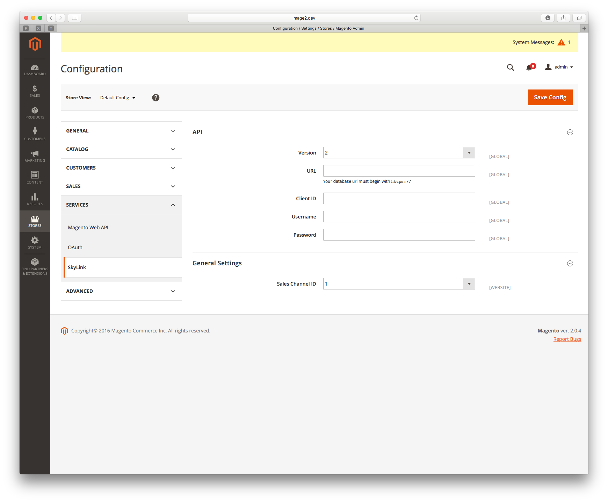
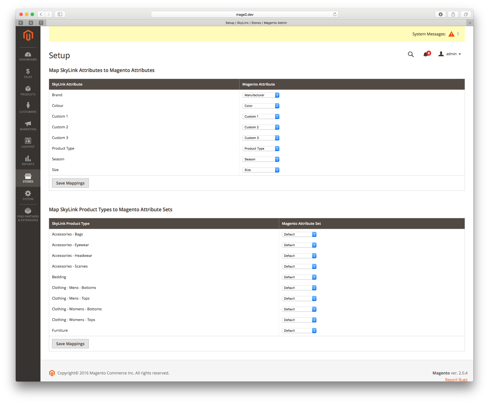
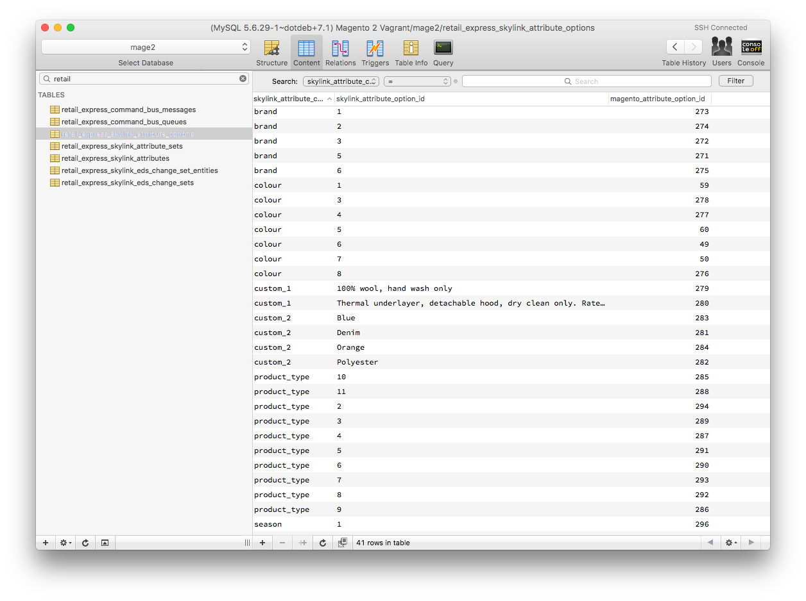

# SkyLink for Magento 2

The following is a technical overview of the usage of SkyLink for Magento 2 and is aimed at developers rather than end-users.

This document is a constant work-in-progress and should be reviewed after each upgrade of the codebase for changes.

Becuase we are in a pre-release state, things will break. **[Backup Magento](http://devdocs.magento.com/guides/v2.0/install-gde/install/cli/install-cli-backup.html)** early and often.

## Installation

Merge the contents of your Magento 2 `composer.json` file with the following JSON payload:

```json
{
    "repositories": [
        {
            "type": "composer",
            "url": "http://repo.ecom.retailexpress.com.au"
        }
    ],
    "require": {
        "retail-express/skylink-magento-2": "^1.0"
    },
    "config": {
        “secure-http”: false
    },
    "minimum-stability": "alpha”
}
```
[Update](https://getcomposer.org/doc/03-cli.md#update) your Composer dependencies. You will notice a number of new packages under vendor. We're interested in:

1. `vendor/retail-express/command-bus-magento-2` - Magento 2 [command bus](https://tactician.thephpleague.com) implementation wtih support for queued command handlers.
2. `vendor/retail-express/skylink-eds` - framework-agnostic package for integrating with Retail Express' Event-Driven Synchronisation functionality.
3. `vendor/retail-express/skylink-magento-2` - Magento 2 extension to manage synchronisation with Retail Express.
4. `vendor/retail-express/skylink-sdk` - framework-agnostic SDK package for connecting a PHP application to Retail Express

Once the code is all in place, you'll want to install SkyLink and update Magento's database with it's prerequisites:

```bash
php bin/magento setup:install RetailExpress_SkyLink
php bin/magento setup:upgrade
```

## Configuration

You'll need to setup your Retail Express API credentials prior to configuring the extension. At this point, we don't have any pretty error screens telling you to do so, rather, exceptions will be thrown as we cannot talk to the Retail Express API.

### Step 1

Visit `Stores > Settings > Configuration > Services > SkyLink` to setup your connection to Retail Express. All fields are required are not validated until the extension tries to talk to Retail Express in `Step 2`:



### Step 2

Visit `Stores > SkyLink > Setup`. Here, you have the opportunity to map all available SkyLink Attributes and Product Types to Magento Attributes and Attribute Sets respectively.

You must save mappings for both Attributes and Attribute Sets for product synchronisation to occur.

All Attributes must be mapped and there are defaults created when the extension is installed. At this point it shoudl be possible to map multiple SkyLink attributes to the same Magento Attribute, but this is yet to be tested extensively. When you save attribute mappings, SkyLink will retrieve all of the available options from Magento for each SkyLink Attribute and add them to Magento. All SkyLink Attributes are mapped to "dropdown" Magento Attributes.

All Product Types must be mapped to a Magento Attribute Set, and these do not need to be unique.

> Product Types are actually driven off the options from the Product Type SkyLink Attribute. This is the most logical way for us to separate products and will, in the near future, be used to determine rules for how Magento Configurable Products are created. For example, Product Type 1 might use Size & Colour to create Magento Configurable Products, whereas Product Type 2 might use Size and Custom 1.



You may rename Magento Attributes, Magento Attribute Options or SkyLink Attribute Options without any adverse affects; the linkage between all of these references internal IDs (see the `retail_express_skylink_attribute*` SQL tables of your Magento installation).

> **Important:** Custom 1, Custom 2 and Custom 3 are not the same as other Retail Express Attributes.
>
> In Retail Express, most attributes are stored in their own table and have a unique ID to reference them. We call them Predefined Attributes.
>
> Custom 1, Custom 2 and Custom 3 are Ad-Hoc attributes. This is because they're associated with products and do not have a unique identifier. If you change the text of an Ad-Hoc Attribute, we generate a new ID based of this text. As a result, we will create a new option to represent the new ID. New synchronised products will get this data added to them, but it means there will be orphaned options in Magento that must be manually removed.


